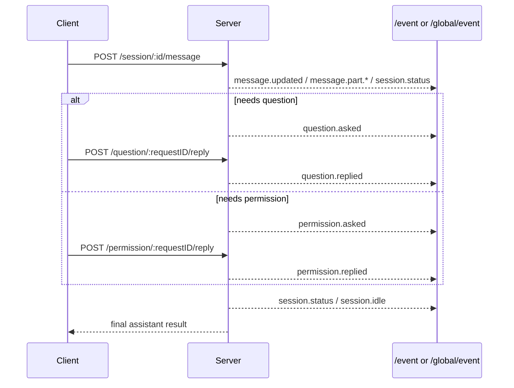

# OpenCode Server API Reference for Bridge Integrations

This document summarizes the OpenCode server API surface that matters for client integrations like this Feishu bridge.

It is based on the cloned reference source in `_reference/opencode`, primarily:

- `packages/opencode/src/server/router.ts`
- `packages/opencode/src/server/instance.ts`
- `packages/opencode/src/server/routes/*.ts`
- `packages/opencode/src/server/event.ts`
- `packages/opencode/src/server/projectors.ts`
- `packages/sdk/openapi.json`

## What matters most

1. **Human-in-the-loop prompts are first-class API objects**:
   - questions: `GET /question`, `POST /question/:requestID/reply`, `POST /question/:requestID/reject`
   - permissions: `GET /permission`, `POST /permission/:requestID/reply`
2. **Runtime execution state is not part of `Session.Info`**. It is exposed separately through:
   - `GET /session/status`
   - streamed `session.status` events
3. **OpenCode exposes two event channels**:
   - bus events: `/event`, `/global/event`
   - sync/event-sourcing stream: `/global/sync-event`
4. **Questions and permissions are resumed by reply APIs**, not by any special "resume session" endpoint.

---

## 1. Routing model

### Control plane vs instance routes

OpenCode splits routing into two layers:

- **control-plane/global routes**: server-wide endpoints such as config, health, global event streams
- **instance routes**: project/directory-scoped endpoints such as sessions, questions, permissions, files, PTY, MCP

Key files:

- `packages/opencode/src/server/server.ts`
- `packages/opencode/src/server/router.ts`
- `packages/opencode/src/server/instance.ts`

### Workspace routing behavior

`WorkspaceRouterMiddleware` resolves a target workspace using query params or headers such as:

- `directory`
- `workspace`
- `x-opencode-directory`
- `x-opencode-workspace`

If the workspace is remote, routing is mixed intentionally:

- `GET /session` can stay local/cached
- `/session/status` is treated as live runtime state and forwarded
- websocket upgrades are proxied

This distinction matters because **session metadata and runtime execution status are treated differently**.

### Routing overview

```mermaid
flowchart TD
  A[HTTP request] --> B[Control plane router]
  B --> C{Global route?}
  C -->|Yes| D[/global/*, /auth/*, /doc, /log]
  C -->|No| E[WorkspaceRouterMiddleware]
  E --> F{Local instance or remote workspace?}
  F -->|Local| G[InstanceRoutes]
  F -->|Remote| H[Proxy with selective local exceptions]
  G --> I[/session]
  G --> J[/question]
  G --> K[/permission]
  G --> L[/event]
  G --> M[/project /pty /mcp /file /provider /tui ...]
```

---

## 2. Global/control-plane endpoints

| Method | Path                 | Purpose                                        |
| ------ | -------------------- | ---------------------------------------------- |
| GET    | `/global/health`     | health/version                                 |
| GET    | `/global/event`      | global bus SSE stream `{ directory, payload }` |
| GET    | `/global/sync-event` | sync/event-sourcing SSE stream                 |
| GET    | `/global/config`     | read config                                    |
| PATCH  | `/global/config`     | update config                                  |
| POST   | `/global/dispose`    | dispose all instances                          |
| POST   | `/global/upgrade`    | run upgrade flow                               |
| PUT    | `/auth/:providerID`  | write auth/provider credentials                |
| DELETE | `/auth/:providerID`  | remove auth/provider credentials               |
| GET    | `/doc`               | OpenAPI schema                                 |
| POST   | `/log`               | application log ingestion                      |

For bridge work, the most relevant global endpoint is **`GET /global/event`**.

---

## 3. Instance route groups

Mounted by `packages/opencode/src/server/instance.ts`:

| Base path       | Route file                                | Purpose                              |
| --------------- | ----------------------------------------- | ------------------------------------ |
| `/project`      | `routes/project.ts`                       | project list/current/update/git init |
| `/pty`          | `routes/pty.ts`                           | PTY lifecycle + attach               |
| `/config`       | `routes/config.ts`                        | instance config                      |
| `/experimental` | `routes/experimental.ts`                  | advanced internal APIs               |
| `/session`      | `routes/session.ts`                       | sessions, messages, prompt execution |
| `/permission`   | `routes/permission.ts`                    | pending permissions + replies        |
| `/question`     | `routes/question.ts`                      | pending questions + replies          |
| `/provider`     | `routes/provider.ts`                      | provider metadata/auth flows         |
| `/mcp`          | `routes/mcp.ts`                           | MCP status/connect/auth              |
| `/tui`          | `routes/tui.ts`                           | TUI control/event APIs               |
| `/`             | `routes/file.ts`, `routes/event.ts`, etc. | file APIs and instance event stream  |

---

## 4. Session API

Primary file: `packages/opencode/src/server/routes/session.ts`

### Core session lifecycle endpoints

| Method | Path                            | Purpose                                |
| ------ | ------------------------------- | -------------------------------------- |
| GET    | `/session`                      | list sessions                          |
| GET    | `/session/status`               | runtime status map for active sessions |
| GET    | `/session/:sessionID`           | get session metadata                   |
| POST   | `/session`                      | create session                         |
| PATCH  | `/session/:sessionID`           | update title/archive metadata          |
| DELETE | `/session/:sessionID`           | delete session                         |
| POST   | `/session/:sessionID/fork`      | fork session                           |
| POST   | `/session/:sessionID/abort`     | abort current run                      |
| POST   | `/session/:sessionID/share`     | share session                          |
| DELETE | `/session/:sessionID/share`     | unshare session                        |
| GET    | `/session/:sessionID/children`  | child sessions                         |
| GET    | `/session/:sessionID/todo`      | current todo state                     |
| GET    | `/session/:sessionID/diff`      | snapshot diff                          |
| POST   | `/session/:sessionID/summarize` | summarization                          |
| POST   | `/session/:sessionID/revert`    | revert to message/part                 |
| POST   | `/session/:sessionID/unrevert`  | clear revert                           |

### Prompt/message execution endpoints

| Method | Path                                                  | Purpose                                    |
| ------ | ----------------------------------------------------- | ------------------------------------------ |
| GET    | `/session/:sessionID/message`                         | list messages                              |
| GET    | `/session/:sessionID/message/:messageID`              | get one message                            |
| DELETE | `/session/:sessionID/message/:messageID`              | delete one message                         |
| PATCH  | `/session/:sessionID/message/:messageID/part/:partID` | patch one part                             |
| DELETE | `/session/:sessionID/message/:messageID/part/:partID` | delete one part                            |
| POST   | `/session/:sessionID/message`                         | prompt and wait for final assistant result |
| POST   | `/session/:sessionID/prompt_async`                    | async prompt kickoff                       |
| POST   | `/session/:sessionID/command`                         | command-style execution                    |
| POST   | `/session/:sessionID/shell`                           | shell execution                            |
| POST   | `/session/:sessionID/init`                            | init provider/model/message context        |

### Important contract note

`Session.Info` is persistent session metadata. It is **not** the runtime state machine.

Runtime state is separate and exposed through:

- `GET /session/status`
- `session.status` events on the bus stream

---

## 5. Question API

Primary file: `packages/opencode/src/server/routes/question.ts`

### Endpoints

| Method | Path                          | Request                   | Response             |
| ------ | ----------------------------- | ------------------------- | -------------------- |
| GET    | `/question`                   | none                      | `Question.Request[]` |
| POST   | `/question/:requestID/reply`  | `{ answers: string[][] }` | `true`               |
| POST   | `/question/:requestID/reject` | none                      | `true`               |

### Important behavior

- Questions are stored in an **in-memory pending map** until answered or rejected.
- Replying to a question resolves the waiting execution path.
- Rejecting a question fails the waiting execution path.
- There is no special "session resume" API. The question reply itself is the resume signal.

### Shape of a pending question request

From `packages/opencode/src/question/index.ts` / `schema.ts`:

- `id`
- `sessionID`
- `questions[]`
  - `question`
  - `header`
  - `options[]`
  - `multiple?`
  - `custom?`
- optional `tool` context (`messageID`, `callID`)

---

## 6. Permission API

Primary file: `packages/opencode/src/server/routes/permission.ts`

### Endpoints

| Method | Path                           | Request                                               | Response               |
| ------ | ------------------------------ | ----------------------------------------------------- | ---------------------- |
| GET    | `/permission`                  | none                                                  | `Permission.Request[]` |
| POST   | `/permission/:requestID/reply` | `{ reply: "once" \| "always" \| "reject", message? }` | `true`                 |

### Deprecated compatibility path

There is also a deprecated session-scoped responder in `routes/session.ts`:

- `POST /session/:sessionID/permissions/:permissionID`

The current OpenCode browser app still uses this compatibility endpoint in some places, so clients may encounter both conventions.

### Permission reply semantics

- `once`: approve only this request
- `always`: approve this request and extend in-memory allow rules for the current session
- `reject`: deny and fail the waiting execution path

---

## 7. Event streams

### Instance event stream

Primary file: `packages/opencode/src/server/routes/event.ts`

- path: `GET /event`
- transport: SSE
- emits:
  - synthetic `server.connected`
  - synthetic `server.heartbeat`
  - bus events `{ type, properties }`

### Global event stream

Primary file: `packages/opencode/src/server/routes/global.ts`

- path: `GET /global/event`
- transport: SSE
- payload:

```json
{
  "directory": "/path/to/workspace",
  "payload": {
    "type": "question.asked",
    "properties": { "...": "..." }
  }
}
```

### Sync event stream

- path: `GET /global/sync-event`
- transport: SSE
- payload is versioned event-sourcing data such as `session.updated.1`

### Event model overview

```mermaid
flowchart LR
  A[OpenCode runtime] --> B[Bus.publish runtime events]
  A --> C[SyncEvent.run persisted events]
  C --> D[Projectors update DB]
  C --> E[/global/sync-event]
  B --> F[/event]
  B --> G[/global/event]
  C --> G
```

### Integration-relevant bus events

- `session.status`
- `session.idle`
- `session.error`
- `session.diff`
- `message.updated`
- `message.part.updated`
- `message.part.delta`
- `todo.updated`
- `question.asked`
- `question.replied`
- `question.rejected`
- `permission.asked`
- `permission.replied`

---

## 8. Integration-critical flow

For a bridge client, the most important request/response cycle is this:



### Practical implication

If a client only renders a local button/card but does **not** call the corresponding reply endpoint, OpenCode will keep waiting.

---

## 9. Key code references

| Concern                               | File                                                        |
| ------------------------------------- | ----------------------------------------------------------- |
| workspace routing                     | `packages/opencode/src/server/router.ts`                    |
| instance mounts                       | `packages/opencode/src/server/instance.ts`                  |
| global routes                         | `packages/opencode/src/server/routes/global.ts`             |
| instance event SSE                    | `packages/opencode/src/server/routes/event.ts`              |
| session routes                        | `packages/opencode/src/server/routes/session.ts`            |
| question routes                       | `packages/opencode/src/server/routes/question.ts`           |
| permission routes                     | `packages/opencode/src/server/routes/permission.ts`         |
| server event compatibility projectors | `packages/opencode/src/server/projectors.ts`                |
| question runtime                      | `packages/opencode/src/question/index.ts`                   |
| permission runtime                    | `packages/opencode/src/permission/index.ts`                 |
| session runtime                       | `packages/opencode/src/session/*.ts`                        |
| generated SDK/OpenAPI                 | `packages/sdk/openapi.json`, `packages/sdk/js/src/v2/gen/*` |

---

## 10. Bridge-facing takeaways

1. **Subscribe to events** and **poll bootstrap state**. A correct client needs both.
2. Treat **questions** and **permissions** as independent pending resources, not just UI affordances.
3. Keep session metadata and runtime status separate.
4. Do not infer resume/completion from card interaction alone; wait for:
   - reply endpoint success
   - follow-up event(s)
   - runtime status settling
5. Compatibility still matters because OpenCode currently uses both modern and deprecated permission reply paths.
