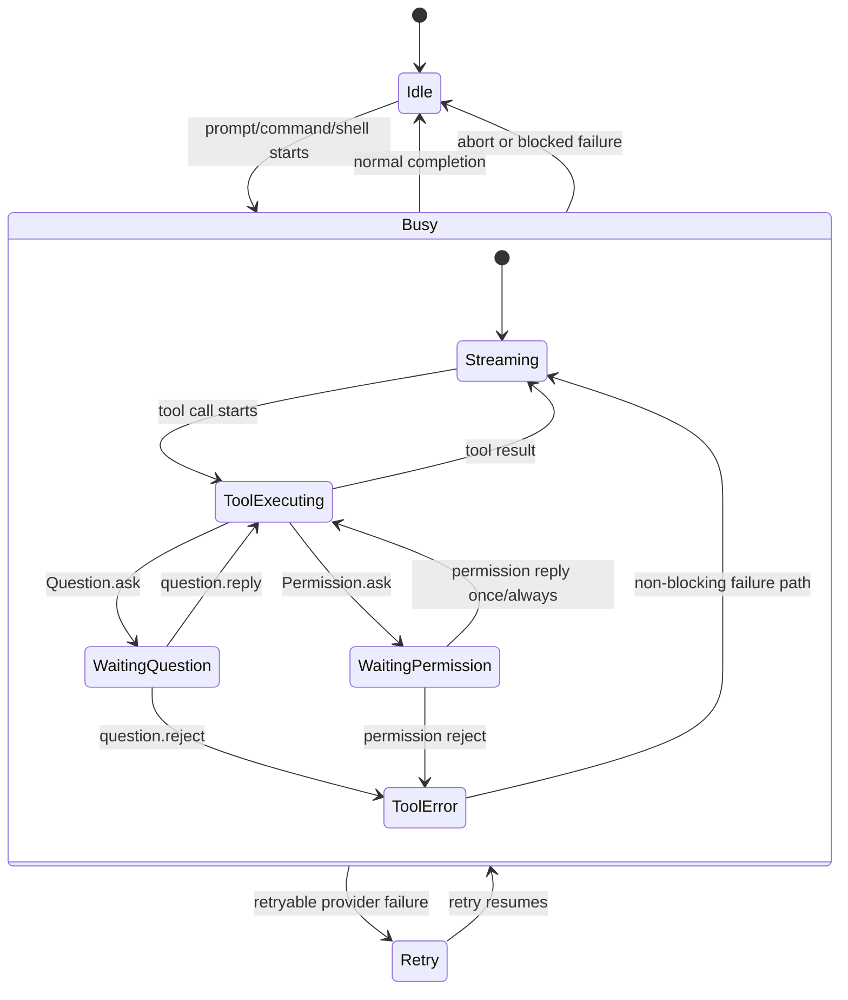
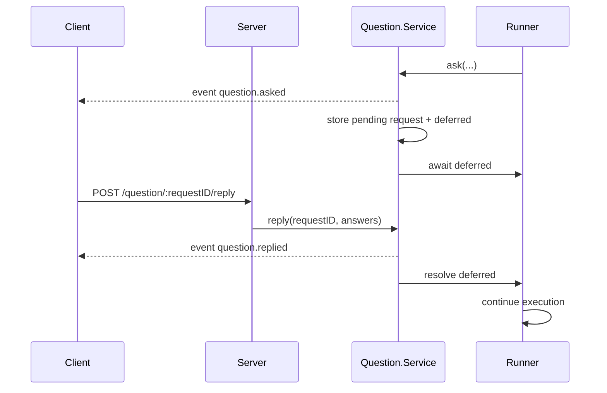
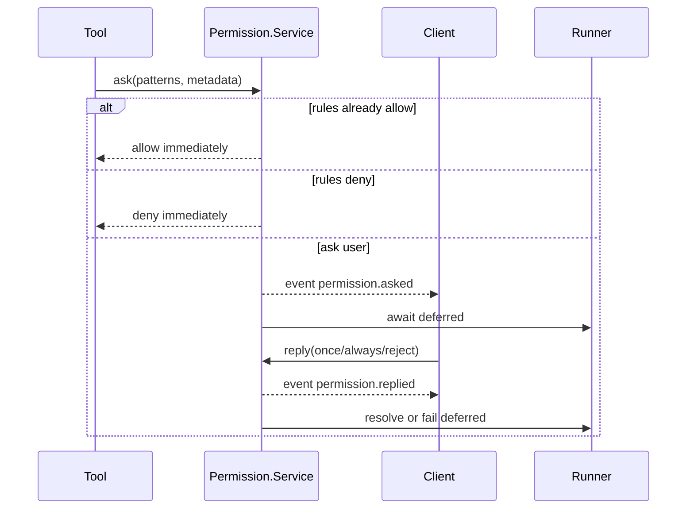

# OpenCode Session State Reference

This document focuses on the runtime state machine behind OpenCode sessions.

It is narrower than the general API reference: the goal here is to explain **how a session moves from create -> running -> waiting for user input -> resumed -> idle/error**, and how that state is represented in code.

Primary source files:

- `_reference/opencode/packages/opencode/src/session/index.ts`
- `_reference/opencode/packages/opencode/src/session/status.ts`
- `_reference/opencode/packages/opencode/src/session/run-state.ts`
- `_reference/opencode/packages/opencode/src/session/prompt.ts`
- `_reference/opencode/packages/opencode/src/session/processor.ts`
- `_reference/opencode/packages/opencode/src/question/index.ts`
- `_reference/opencode/packages/opencode/src/permission/index.ts`

## Executive summary

The most important thing to understand is this:

- **Session metadata is persistent** (`Session.Info`)
- **Session runtime status is ephemeral** (`busy`, `retry`, implicit `idle`)
- **Pending questions and permissions are separate runtime objects**
- **While waiting for a user reply, the session still looks `busy`**

That last point is the one that matters most for the Feishu bridge bug.

---

## 1. Three different kinds of state

### A. Persistent session metadata

`Session.Info` stores long-lived metadata such as:

- `id`
- `projectID`
- `workspaceID`
- `directory`
- `title`
- `parentID`
- `summary`
- `share`
- `permission`
- `revert`
- `time.created`, `time.updated`, `time.archived`

This is what `GET /session/:id` returns.

### B. Ephemeral runtime status

`SessionStatus.Info` is defined in `session/status.ts`:

- `{ type: "busy" }`
- `{ type: "retry", attempt, message, next }`
- `idle` is implicit rather than stored

Important detail:

- idle sessions are removed from the runtime map
- therefore `GET /session/status` only contains **non-idle sessions**

### C. Pending human-in-the-loop state

Questions and permissions live in separate runtime services:

- `question/index.ts`
- `permission/index.ts`

These hold in-memory pending requests plus deferred continuations.

---

## 2. Session lifecycle

### Phase 1: create

`POST /session` ultimately creates a `Session.Info` record and projects it into storage.

At this point the session exists, but it is not yet "running".

### Phase 2: start execution

A session effectively starts when an execution endpoint is called, for example:

- `POST /session/:sessionID/message`
- `POST /session/:sessionID/prompt_async`
- `POST /session/:sessionID/command`
- `POST /session/:sessionID/shell`

This enters `SessionPrompt.prompt()` / `SessionPrompt.loop()`.

### Phase 3: runner becomes active

`SessionRunState.ensureRunning()` ensures there is one active runner per session.

The prompt loop then:

1. touches the session
2. creates/updates user message state
3. sets `SessionStatus` to `busy`
4. runs the processor loop

### Phase 4: LLM/tool execution

`SessionProcessor.process()` handles streaming model output, tool calls, tool results, and tool failures.

### Phase 5: optional human-in-the-loop pause

If the runtime needs a human decision, it emits either:

- `question.asked`
- `permission.asked`

But the session does **not** become idle here. It stays `busy` because the same runner is still in flight.

### Phase 6: reply or reject

When the client posts a question or permission reply, the corresponding deferred continuation is resolved or failed.

That causes the tool path to:

- resume normally
- continue with a corrected/error branch
- or stop the run entirely

### Phase 7: settle

When the runner exits, the session eventually emits:

- `session.status` transitioning toward idle/retry
- `session.idle`
- or `session.error`

---

## 3. State machine

### Runtime state machine

### Key implication

There is **no dedicated runtime status like**:

- `waiting_for_question`
- `waiting_for_permission`

Those are internal substates inside `busy`, not separate public statuses.

---

## 4. Question flow

### How a question is created

Typical tool flow:

1. tool calls `Question.ask(...)`
2. OpenCode creates a question request ID
3. it stores `{ request, deferred }` in the in-memory pending map
4. it publishes `question.asked`
5. it waits on the deferred value

### While the question is pending

OpenCode is still inside the same active runner.

That means:

- `session.status` remains `busy`
- the original execution is paused, not finished
- the client must answer the question through the API

### How a question resumes execution

Client calls:

- `POST /question/:requestID/reply`

OpenCode then:

1. publishes `question.replied`
2. resolves the deferred continuation
3. resumes the blocked tool
4. continues the processor loop

### How a question stops execution

Client calls:

- `POST /question/:requestID/reject`

OpenCode then:

1. publishes `question.rejected`
2. fails the deferred continuation
3. converts that into a tool error / blocked execution path
4. eventually settles the session

### Question flow diagram

---

## 5. Permission flow

### Permission evaluation happens before asking

`Permission.ask(...)` does not always create a pending request.

It first evaluates requested patterns against:

- static rules
- merged session/agent rules
- in-memory approved rules

Possible outcomes:

- immediate allow
- immediate deny
- requires human reply -> emit `permission.asked`

### While permission is pending

Same rule as questions:

- the session remains `busy`
- the runner is still active
- OpenCode is waiting for an explicit permission reply

### Reply outcomes

- `once`: continue only this request
- `always`: continue this request and extend in-memory allow behavior for the session
- `reject`: fail the waiting permission path

### Permission flow diagram

---

## 6. Why sessions stay `busy` while waiting for a user

This is the central implementation detail behind the current Feishu symptom.

OpenCode does **not** model a user-waiting state as idle. Instead:

- the session runner is still alive
- the active tool call is waiting on a deferred answer
- `SessionStatus` stays `busy`

So a correct client should interpret state as:

- `busy` + `question.asked` = waiting on user question input
- `busy` + `permission.asked` = waiting on user permission input

The public status API alone is not enough to distinguish these substates.

---

## 7. Data sources a client must combine

To render session state correctly, a client needs all of the following:

| Concern                     | Source                                                                        |
| --------------------------- | ----------------------------------------------------------------------------- |
| persistent session metadata | `GET /session/:id`                                                            |
| active runtime state        | `GET /session/status` + `session.status` events                               |
| pending questions           | `GET /question` + `question.asked` / `question.replied` / `question.rejected` |
| pending permissions         | `GET /permission` + `permission.asked` / `permission.replied`                 |
| transcript/tool progress    | `message.updated`, `message.part.updated`, `message.part.delta`               |

This explains why a client that only looks at one channel can get stuck or look inconsistent.

---

## 8. Practical implications for this bridge

1. **`busy` is not wrong by itself** when a question is pending.
2. The bridge must separately remember that the busy session is currently blocked on:
   - a question request ID, or
   - a permission request ID.
3. Local UI confirmation is not enough. The bridge must call the correct reply endpoint.
4. Correct cleanup requires waiting for the server-side reply + follow-up event progression.
5. Bootstrap matters: after reconnect/restart, pending questions and permissions must be reloaded from the list endpoints.

---

## 9. Key files to read first

| Concern                   | File                                                                    |
| ------------------------- | ----------------------------------------------------------------------- |
| persistent session model  | `_reference/opencode/packages/opencode/src/session/index.ts`            |
| runtime status map        | `_reference/opencode/packages/opencode/src/session/status.ts`           |
| runner ownership          | `_reference/opencode/packages/opencode/src/session/run-state.ts`        |
| prompt loop               | `_reference/opencode/packages/opencode/src/session/prompt.ts`           |
| processor/tool loop       | `_reference/opencode/packages/opencode/src/session/processor.ts`        |
| question runtime          | `_reference/opencode/packages/opencode/src/question/index.ts`           |
| permission runtime        | `_reference/opencode/packages/opencode/src/permission/index.ts`         |
| question tool integration | `_reference/opencode/packages/opencode/src/tool/question.ts`            |
| server question route     | `_reference/opencode/packages/opencode/src/server/routes/question.ts`   |
| server permission route   | `_reference/opencode/packages/opencode/src/server/routes/permission.ts` |
