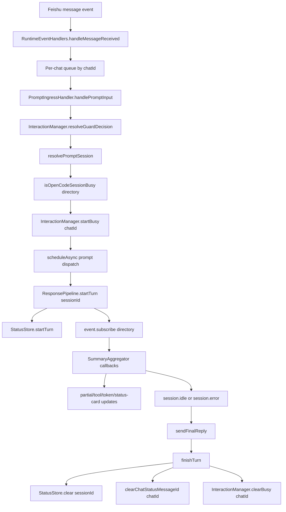
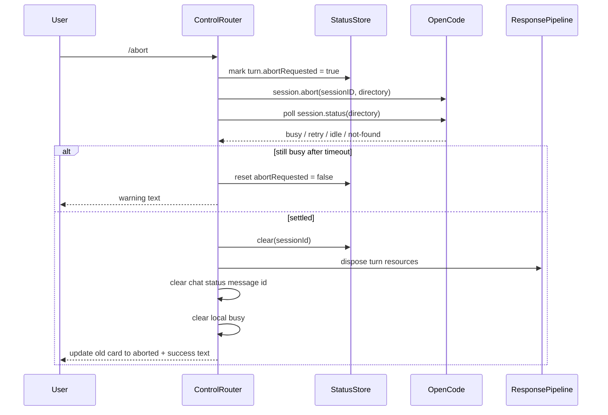

# OpenCode Session State in `opencode-feishu-bridge`

This document explains how the bridge understands OpenCode session state today, where that state lives, how a prompt moves through the system, why `/abort` is subtle, and what currently happens when multiple chats target the same project directory.

It is intentionally implementation-oriented. The goal is to help future contributors debug behavior quickly without having to reconstruct the state machine from logs and scattered modules.

## Why this doc exists

The bridge does **not** have a single source of truth for "session state". What users perceive as "busy" or "idle" is the result of several layers working together:

1. **Per-chat bridge state** (`InteractionManager`)
2. **Per-session turn state** (`StatusStore`)
3. **OpenCode server state** (`session.status({ directory })`)
4. **OpenCode event stream** (`event.subscribe({ directory })`)

Most of the bugs we hit around `/abort`, busy feedback, and session isolation came from assuming those layers changed at the same moment. They do not.

---

## Mental model

### State is split across three scopes

| Scope            | Owner                                             | Key         | What it stores                                                              |
| ---------------- | ------------------------------------------------- | ----------- | --------------------------------------------------------------------------- |
| Chat-scoped      | `src/settings/manager.ts`                         | `chatId`    | current session for that chat, status-card message id                       |
| Chat-scoped      | `src/interaction/manager.ts`                      | `chatId`    | local busy flag and question/permission interaction state                   |
| Session-scoped   | `src/feishu/status-store.ts`                      | `sessionId` | active turn lifecycle, partial text, tool events, status-card runtime state |
| Directory-scoped | OpenCode `session.status()` / `event.subscribe()` | `directory` | remote busy/retry/idle status and event stream                              |

The key implication is that **chat isolation is local**, while **remote status and event subscription are directory-scoped**.

### The bridge's working rule

Use this rule of thumb when reading the code:

- `InteractionManager` answers: **"Can this chat accept a new input right now?"**
- `StatusStore` answers: **"What is the active turn for this session right now?"**
- OpenCode `session.status()` answers: **"Is any session in this directory busy or retrying right now?"**
- OpenCode events answer: **"What happened next for the currently subscribed directory stream?"**

---

## Where state lives

### 1. Per-chat session selection

`src/settings/manager.ts`

- `chatSessions: Map<string, SessionInfo>`
- `chatStatusMessageIds: Map<string, string>`
- `currentProject`, `currentModel`, `currentAgent` remain global

Important behavior:

- Chat session state is **in-memory only**.
- It is **not persisted** to `settings.json`.
- Project/model/agent settings **are** persisted.

### 2. Per-chat busy and interaction guards

`src/interaction/manager.ts`

- `busyStates: Map<string, BusyState>`
- `states: Map<string, InteractionState>`

These are separate:

- `busyStates` blocks ordinary prompts while a turn is in progress.
- `states` tracks interactive flows such as question/permission cards.

Busy mode still allows:

- `/abort`
- `/status`
- `/help`

### 3. Per-session turn lifecycle

`src/feishu/status-store.ts`

- `turns: Map<string, StatusTurnState>`

Each active turn stores:

- `sessionId`, `directory`, `receiveId`, `sourceMessageId`
- `statusCardMessageId`
- partial/completed answer text
- reasoning/tool/token metadata
- `subscriptionAbortController`
- `statusUpdateTimer`
- `abortRequested`

That `abortRequested` flag is important: it tells the response pipeline that a user-triggered abort is already in progress, so later `session.idle` / `session.error` callbacks should not be rendered as normal reply/error completions.

---

## Main prompt lifecycle

### High-level flow

### Detailed step-by-step

#### 1. Message ingress is serialized per chat

`src/app/runtime-event-handlers.ts`

`handleMessageReceived()` builds a queue key from `chatId` and runs `processMessageReceived()` inside `enqueueMessageTask(queueKey, ...)`.

That means:

- messages inside the **same chat** are serialized
- messages from **different chats** are independent

#### 2. Guard first, session next, remote busy after that

`src/feishu/handlers/prompt.ts`

`handlePromptDispatch()` does the work in this order:

1. `interactionManager.resolveGuardDecision(chatId, input)`
2. `resolvePromptSession(...)`
3. optional poisoned-file-history reset for file prompts
4. `isOpenCodeSessionBusy(statusClient, directory)`
5. `interactionManager.startBusy(chatId)`
6. async prompt dispatch via `openCodePromptAsync.promptAsync(...)`

That order matters:

- A prompt can be blocked by **local busy/interaction state** before remote state is even checked.
- A prompt can also be blocked by **remote directory busy** even if the local chat is idle.

#### 3. Session resolution is per chat, not global

`src/feishu/handlers/session-resolution.ts`

`resolvePromptSession()`:

- returns `no-project` if no current project is set
- clears chat session if the stored session directory no longer matches the selected project
- reuses the chat's existing session if still valid
- otherwise creates a new OpenCode session with `openCodeSession.create({ directory })`

#### 4. Prompt dispatch is async, but the wrapper name is slightly misleading

`src/opencode/prompt-client.ts`

The bridge abstraction is named `promptAsync`, but the current implementation wraps:

- `openCodeClient.session.prompt(...)`

That call happens inside a scheduled async task from `PromptIngressHandler`, so the **chat handler** still returns immediately, but the underlying SDK call is not using `session.promptAsync()` today.

This is worth remembering when comparing this repo to local references such as `opencode-telegram-bot`.

---

## How completion works

### Response pipeline ownership

`src/feishu/response-pipeline.ts`

When a prompt is accepted:

1. `RuntimeEventHandlers.handlePromptResult()` calls `pipelineController.startTurn(...)`
2. `startTurn()` writes a `StatusTurnState` into `StatusStore`
3. `startTurn()` creates a turn-local `AbortController`
4. `runEventSubscription()` subscribes to OpenCode events for the turn's `directory`

### Finalization paths

There are two normal terminal paths:

- `handleSessionIdle(sessionId)`
- `handleSessionError(sessionId, message)`

Both eventually call `finishTurn(sessionId)`, which:

- clears the turn from `StatusStore`
- aborts the event subscription controller
- clears the chat's saved status-card message id
- clears `InteractionManager` busy for that chat

### Why `session.idle` is preferred over partial text

On idle, the pipeline tries to fetch the last assistant message from the OpenCode API before sending the final card. That is why some final replies are based on API-fetched text instead of only the streaming deltas.

---

## `/status` semantics

`src/feishu/control-router.ts`

`/status` merges **local** and **server** state instead of blindly trusting one source.

It computes:

- `hasLocalBusyState = interactionManager.isBusy(chatId) || Boolean(turnState)`
- initial `state = busy | idle` from local data
- then fetches `openCodeSession.status({ directory })`
- then reads only `statusMap[currentSession.id]`

Important nuance:

- if local busy is already gone, but the server still briefly reports `busy` / `retry`, `/status` **ignores that transient remote busy**

This was added specifically because local cleanup can happen slightly earlier than the server's final state transition.

---

## `/abort` semantics

`src/feishu/control-router.ts`

### Current flow

### Why the polling exists

Calling `session.abort(...)` is not enough by itself.

We learned the hard way that this sequence is possible:

1. local bridge state is cleared
2. user sends the next prompt immediately
3. OpenCode still reports the directory as `busy`
4. prompt ingress blocks the new prompt with busy feedback

So `/abort` now waits until the server-side session actually leaves `busy` / `retry` before it reports success.

### Why aborted turns should not later render `error`

Once a user-triggered abort begins, the turn is marked with `abortRequested` in `StatusStore`.

`src/feishu/response-pipeline.ts`

That makes `handleSessionIdle()` and `handleSessionError()` ignore late terminal callbacks for the aborted turn. Without that flag, the UI can show a confusing follow-up `error` completion after the user already saw an abort card.

### Current aborted wording

The bridge uses:

- card title: `"${ASSISTANT_NAME} aborted"`
- body text: `"✅ 已取消当前操作"`

The distinction is intentional:

- **title** describes the terminal session state
- **body text** describes the user-visible action that just succeeded

---

## Concurrency model

This is the section that matters most when debugging surprising busy behavior.

### What is isolated correctly today

#### Per-chat message ordering

`RuntimeEventHandlers` queues messages by `chatId`.

So:

- Chat A does not block Chat B at the ingress queue layer
- but Chat A can still affect Chat B later via shared directory-scoped remote state

#### Per-chat session identity

`SettingsManager.chatSessions` means different chats can hold different `sessionId`s, even when both are working in the same project directory.

#### Per-chat local busy state

`InteractionManager.busyStates` is keyed by `chatId`, so local "busy" is chat-isolated.

### What is **not** isolated today

#### 1. Busy preflight is directory-scoped

`src/feishu/handlers/prompt.ts`

`isOpenCodeSessionBusy()` calls `session.status({ directory })` and returns busy if **any** session in that directory is `busy` or `retry`.

That means:

- Chat A can own `sessionA`
- Chat B can own `sessionB`
- if both target the same `directory`, Chat B can still be blocked by Chat A's in-flight work

This is the most important current limitation for same-project multi-session concurrency.

#### 2. Event subscription is a singleton per process

`src/opencode/events.ts`

`OpenCodeEventSubscriber` keeps:

- one `activeDirectory`
- one `eventCallback`
- one `streamAbortController`

Behavior today:

- if a second subscription starts for the **same directory**, the subscriber just replaces `eventCallback`
- if a second subscription starts for a **different directory**, it stops the current listener and starts a new one

So the current design assumption is effectively:

> one active event listener per process, organized around one active directory at a time

That is compatible with the current busy-preflight policy, but it is **not** true independent same-directory concurrency.

#### 3. The response pipeline also assumes one active turn context at a time

`ResponsePipeline.startTurn()` calls `summaryAggregator.setSession(sessionId)` before subscribing.

That is another hint that the system is optimized for **one active turn context per directory/event stream**, not many fully independent same-directory concurrent turns.

### Practical implication

If two chats choose the same project directory, the bridge currently behaves closer to:

- **per-chat session selection**
- **but per-directory execution ownership**

That is a useful mental model for contributors.

---

## Module responsibilities

| Module                                      | Responsibility                                                                     |
| ------------------------------------------- | ---------------------------------------------------------------------------------- |
| `src/feishu/handlers/session-resolution.ts` | create/reuse/reset chat-bound OpenCode session                                     |
| `src/feishu/handlers/prompt.ts`             | guard input, resolve session, check remote busy, start local busy, dispatch prompt |
| `src/opencode/prompt-client.ts`             | bridge wrapper around OpenCode prompt call                                         |
| `src/interaction/manager.ts`                | local busy state and question/permission guard logic                               |
| `src/feishu/status-store.ts`                | active turn runtime state keyed by `sessionId`                                     |
| `src/feishu/response-pipeline.ts`           | subscribe to events, update status cards, send final replies, clear turn state     |
| `src/opencode/events.ts`                    | process-wide OpenCode event subscriber and reconnect logic                         |
| `src/app/runtime-event-handlers.ts`         | Feishu ingress queueing and dispatch orchestration                                 |
| `src/feishu/control-router.ts`              | slash commands including `/status` and `/abort`                                    |
| `src/app/runtime-summary-aggregator.ts`     | connects summary events to question/permission flows and interaction cleanup       |

---

## Debugging checklist

When a session-state bug shows up, check these in order.

### 1. Did the message enter the bridge?

Look for:

- `RuntimeEventHandlers` ingress logs
- prompt blocked vs dispatched logs

### 2. Was it blocked locally or remotely?

Look for one of these:

- `Blocked by interaction guard` → local busy / question / permission guard
- `Blocked: OpenCode session is busy for directory=...` → remote directory-scoped busy preflight

### 3. Was a turn actually started?

Look for:

- `ResponsePipeline Starting turn`
- `InteractionManager Busy state started`

If you do not see these, the prompt never made it past ingress.

### 4. Did the event stream settle the turn?

Look for:

- `Session idle reached finalization`
- `Handling session error`
- `Finishing turn`
- `Busy state cleared`

If `Busy state cleared` never appears, local busy probably never completed its normal cleanup path.

### 5. Did `/abort` settle remotely?

Look for:

- `Aborted session:`
- `Abort request did not settle in time:`
- `/status` logs ignoring transient busy after local cleanup

---

## Development rules going forward

1. **Do not assume local busy and remote busy change at the same time.**
2. **Do not clear busy optimistically after `/abort` without confirming the server settled.**
3. **When documenting or debugging concurrency, think in directories, not only session IDs.**
4. **Treat same-directory multi-session execution as a limitation unless the event subscriber model changes.**
5. **If you change finalization behavior, check normal completion, error completion, and abort completion separately.**

---

## Current known limitation

The bridge now has solid **per-chat session isolation** for selected session, busy state, and status-card bookkeeping.

It does **not** yet provide true independent concurrency for multiple active sessions under the same project directory, because both:

- remote busy preflight, and
- event subscription ownership

are currently organized around `directory`.

If future work requires true same-project concurrent sessions, the bridge will need a deeper redesign of busy gating and event-stream ownership rather than a small patch.
