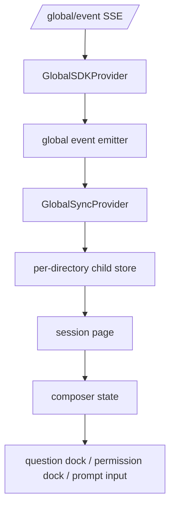
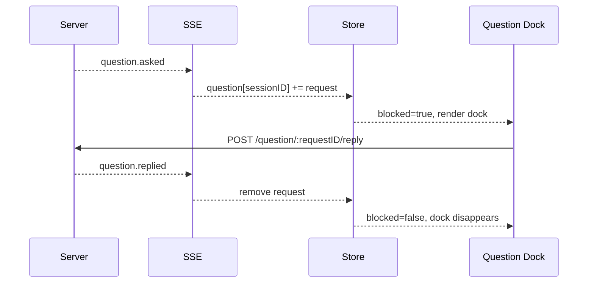
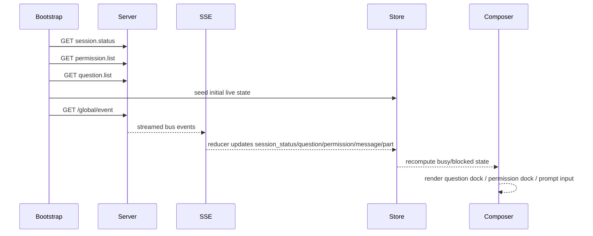

# OpenCode Web Client Interaction Reference

This document explains how the OpenCode browser client handles live session state, pending questions/permissions, and user interaction.

## Important scope correction

The cloned repository contains two different "web" surfaces:

- `packages/web` = documentation/share viewer package
- `packages/app` = the actual interactive browser client

For the Feishu bridge, the **real implementation to mirror is `packages/app`**, not `packages/web`.

---

## 1. Package roles

### `packages/web`

This package is an Astro/Starlight site:

- docs site
- static pages
- read-only share viewer

It is **not** the runtime app that answers questions or permissions.

### `packages/app`

This package is the actual interactive browser client:

- Vite + Solid app
- SDK client setup
- global SSE subscription
- session page, composer, question dock, permission dock
- live busy/waiting UI

---

## 2. Event subscription architecture

Primary files:

- `_reference/opencode/packages/app/src/context/global-sdk.tsx`
- `_reference/opencode/packages/app/src/context/global-sync.tsx`
- `_reference/opencode/packages/app/src/context/global-sync/bootstrap.ts`
- `_reference/opencode/packages/app/src/context/global-sync/event-reducer.ts`

### Transport

The app subscribes to:

- `GET /global/event`

using the generated SDK client.

### How the app manages the stream

`GlobalSDKProvider` does the heavy lifting:

- starts the SSE stream
- coalesces noisy event types
- maintains heartbeat timeout
- reconnects after failures
- re-emits events by `directory`

### Stream path

---

## 3. Bootstrap behavior

On startup for a directory, the app does not rely only on future SSE events.

It also bootstraps state with API calls, including:

- `session.status()`
- `permission.list()`
- `question.list()`
- session loading
- config, project, path, VCS, MCP, commands, agents

This is a crucial design choice:

> The browser app recovers already-pending questions and permissions from list endpoints during bootstrap.

That means a correct client must support **both**:

- initial snapshot loading
- live incremental event updates

---

## 4. Live stores used by the app

The per-directory child store tracks at least these integration-relevant slices:

- `session`
- `session_status`
- `message`
- `part`
- `todo`
- `permission`
- `question`

This split is important:

- `session_status` is for busy/retry/idle runtime state
- `permission` and `question` are pending human-in-the-loop resources
- `message` / `part` hold transcript and tool-output detail

### Reducer behavior for question/permission state

`event-reducer.ts` updates store state like this:

- `permission.asked` -> insert/update pending permission for `sessionID`
- `permission.replied` -> remove pending permission for `sessionID`
- `question.asked` -> insert/update pending question for `sessionID`
- `question.replied` / `question.rejected` -> remove pending question for `sessionID`

The UI depends on these streamed events to clear the blocking dock.

---

## 5. How the UI decides whether a session is blocked

Primary files:

- `_reference/opencode/packages/app/src/pages/session/composer/session-request-tree.ts`
- `_reference/opencode/packages/app/src/pages/session/composer/session-composer-state.ts`
- `_reference/opencode/packages/app/src/pages/session/composer/session-composer-region.tsx`

### Composer state

The browser client derives:

- current `questionRequest()`
- current `permissionRequest()`
- `blocked()` = there is a pending question or permission
- `busy()` = runtime `session_status` is not idle
- `live()` = busy or blocked

### Render order

The composer region renders in this order:

1. question dock
2. permission dock
3. prompt input (only when not blocked)

So question and permission UI are **blocking bottom docks**, not incidental notifications.

---

## 6. Question interaction flow

Primary file:

- `_reference/opencode/packages/app/src/pages/session/composer/session-question-dock.tsx`

### Supported UX

The browser app supports:

- multiple questions in one request batch
- single-select questions
- multi-select questions
- custom typed answers
- reject/dismiss path

### How replies are sent

Question replies call:

- `sdk.client.question.reply({ requestID, answers })`
- `sdk.client.question.reject({ requestID })`

### Important UI detail

The dock does **not** remove the question from global store on success.

Instead it:

- marks local mutation success
- clears local draft cache
- waits for streamed `question.replied` or `question.rejected`

Only then does the global store clear and the dock disappear.

### Question flow

---

## 7. Permission interaction flow

Primary files:

- `_reference/opencode/packages/app/src/pages/session/composer/session-permission-dock.tsx`
- `_reference/opencode/packages/app/src/pages/session/composer/session-composer-state.ts`
- `_reference/opencode/packages/app/src/context/permission.tsx`

### Supported UX

Permission dock provides buttons for:

- deny
- allow always
- allow once

### Reply path used by the browser app

The current app still uses the compatibility route through SDK helper:

- `sdk.client.permission.respond({ sessionID, permissionID, response })`

That maps to the deprecated session-scoped permission endpoint.

### Auto-accept behavior

The permission context can auto-respond for some sessions/directories.

If auto-accept applies, the visible dock may be filtered away even though the permission event was observed.

### Important UI detail

Same as questions: the dock does **not** locally delete the permission from the authoritative store.

It waits for `permission.replied` to arrive on the event stream.

---

## 8. Busy and waiting semantics in the browser client

The app does **not** flatten everything into a single boolean.

It uses at least three different concepts:

1. `session_status` from runtime events
2. `blocked()` from pending question/permission requests
3. transcript-level cues such as an assistant message that is still incomplete

### Prompt submission behavior

On submit, the app optimistically marks the session busy before the async call settles.

If the submit request fails early, it locally restores idle state and rolls back optimistic message changes.

### Normal completion behavior

In the happy path, busy clears when streamed session runtime state settles back to idle.

That means:

- final text alone is not the whole source of truth
- waiting for question/permission reply is still represented under a live/busy umbrella

---

## 9. Why this matters for the Feishu bridge

To behave like the browser client, the bridge should mirror these rules:

1. **Bootstrap pending state** on startup/reconnect:
   - `session.status`
   - `permission.list`
   - `question.list`
2. **Subscribe to the live event stream** and treat it as authoritative for clearing pending docks/cards.
3. **Do not assume UI click == request resolved**. The server reply plus follow-up event stream must confirm it.
4. Keep **runtime busy state** separate from **question/permission blocked state**.
5. Expect compatibility quirks because OpenCode currently uses both modern and deprecated permission reply paths.

---

## 10. Browser-client reference flow

---

## 11. Key files

| Concern                 | File                                                                                      |
| ----------------------- | ----------------------------------------------------------------------------------------- |
| docs/share package      | `_reference/opencode/packages/web/package.json`                                           |
| interactive browser app | `_reference/opencode/packages/app/package.json`                                           |
| global SSE transport    | `_reference/opencode/packages/app/src/context/global-sdk.tsx`                             |
| global sync bootstrap   | `_reference/opencode/packages/app/src/context/global-sync/bootstrap.ts`                   |
| global event reducer    | `_reference/opencode/packages/app/src/context/global-sync/event-reducer.ts`               |
| composer state          | `_reference/opencode/packages/app/src/pages/session/composer/session-composer-state.ts`   |
| composer region         | `_reference/opencode/packages/app/src/pages/session/composer/session-composer-region.tsx` |
| question dock           | `_reference/opencode/packages/app/src/pages/session/composer/session-question-dock.tsx`   |
| permission dock         | `_reference/opencode/packages/app/src/pages/session/composer/session-permission-dock.tsx` |
| prompt input            | `_reference/opencode/packages/app/src/components/prompt-input.tsx`                        |
| prompt submit path      | `_reference/opencode/packages/app/src/components/prompt-input/submit.ts`                  |
